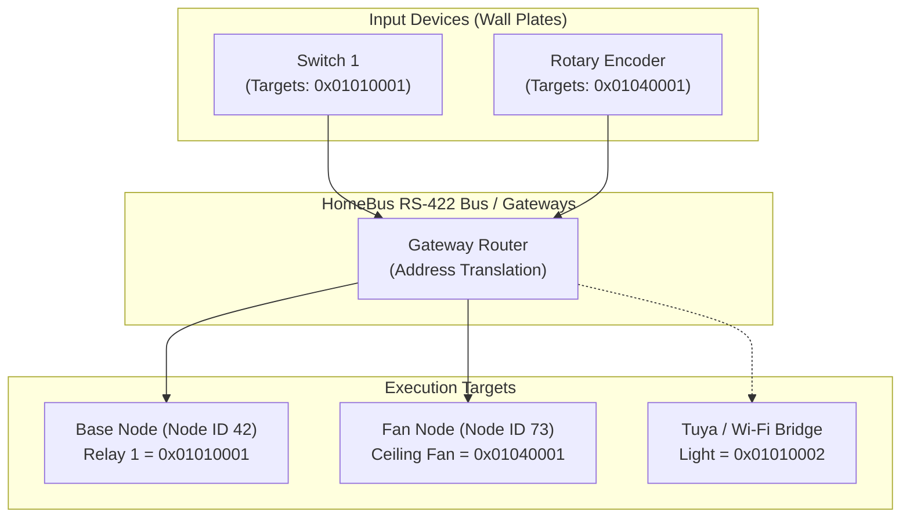
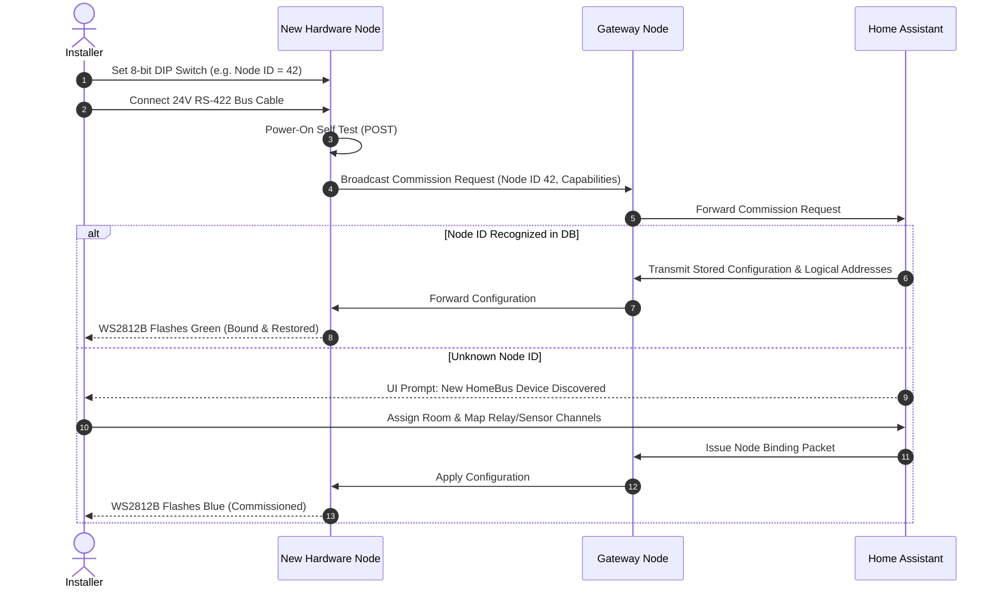

# HomeBus Firmware & Protocol Specification (v0.1)

The **HomeBus Protocol** is a deterministic, distributed home automation communication protocol specifically designed for full-duplex RS-422 wired serial networks, 24V centralized power distribution, and WCH CH32X033 32-bit RISC-V nodes integrated with **Home Assistant**.

---

## Design Philosophy: Hardware vs. Logical Decoupling

The central architectural innovation of HomeBus is the complete decoupling between **Physical Hardware Nodes** and **Logical Controllable Devices**:



### 1. Physical Node
A **Node** represents a physical hardware device connected to the bus (e.g. Base Node, Fan Controller Node, Gateway Node, Sensor Node).
- Every node has an 8-bit **Node ID** (1–255) configured via an onboard 8-position SPST DIP switch.
- **Node IDs are strictly reserved for**:
  - Initial bus commissioning and discovery
  - Over-the-Air (OTA) firmware deployment
  - Device diagnostic pinging and hardware telemetry
  - Network topology mapping
- *Node IDs are never used for normal device actuation or user commands.*

### 2. Logical Device
A **Device** represents a logical controllable endpoint (e.g., *Living Room Chandelier*, *Master Bedroom Ceiling Fan*, *Kitchen Under-Cabinet LED*).
- Each device possesses a 32-bit **Logical Device Address**:
  $$\text{Address} = \mathtt{0xRRTTDDDD}$$
  - **`RR` (8-bit)**: Room Identifier (e.g., `0x01` Living Room, `0x02` Master Bedroom).
  - **`TT` (8-bit)**: Device Type category.
  - **`DDDD` (16-bit)**: Device Unique Index within that room and type.
  - **`0xFFFF`**: Reserved broadcast address for the **Central Controller (Home Assistant)**.

#### Device Decoupling Advantage
Wall switches and input nodes only transmit commands targeting a **Logical Device Address** (`0xRRTTDDDD`). The input switch has no knowledge of whether the endpoint is actuated by an onboard relay on Node 42, an external smart dimmer, or a bridged Tuya Wi-Fi plug. If hardware is replaced or re-wired, no switch configurations need to be changed—only the gateway mapping table is updated.

---

## Packet Specifications

All HomeBus communications use full-duplex RS-422 packet framing. Every packet incorporates a 16-bit CRC checksum. Corrupted packets are immediately dropped without blocking the transceiver.

### 1. Control Packet (Device Action)
Used to actuate a logical device. The packet transmits only the target address and action; source information is omitted because actuators act purely on destination logic.

```text
+-----------------------+---------+----------------+------------------+---------+
|  Destination Address  | Command | Payload Length |  Payload Bytes   |  CRC16  |
|        (32-bit)       | (8-bit) |    (8-bit)     |     (N bytes)    | (16-bit)|
+-----------------------+---------+----------------+------------------+---------+
```

#### Supported Control Commands

| Code | Command Identifier | Payload Schema | Functional Description |
| :---: | :--- | :--- | :--- |
| `0x01` | `SET_STATE` | `0x00` (OFF) / `0x01` (ON) | Forces relay or device to explicit ON or OFF state. |
| `0x02` | `TOGGLE` | None (Length = 0) | Inverts the current output state. |
| `0x03` | `SET_PERCENT` | `0` to `100` (1 byte uint8) | Sets dimmer level or fan speed percentage. |
| `0x04` | `INCREASE_PERCENT`| Delta uint8 (`+1` to `+100`) | Increments output level by the specified percentage. |
| `0x05` | `DECREASE_PERCENT`| Delta uint8 (`-1` to `-100`) | Decrements output level by the specified percentage. |
| `0x06` | `SET_BRIGHTNESS` | `0` to `255` (1 byte uint8) | Sets absolute PWM light intensity. |
| `0x07` | `SET_COLOR` | `R`, `G`, `B` (3 bytes) | Configures RGB light color. |
| `0x08` | `SET_PATTERN` | Pattern ID (uint8) + Rate | Triggers pre-programmed lighting pattern or animation. |
| `0x09` | `IDENTIFY` | Duration in seconds (uint8) | Rapidly flashes node status LED for physical device identification. |

### 2. Telemetry Packet (Sensor Data & Status)
Transmitted by sensor nodes, power meters, and actuators to report real-time readings to the Home Assistant controller (`0xFFFF`).

```text
+-----------------------+---------+-------------+----------------+---------------+---------+
| Destination (0xFFFF)  | Node ID | Sensor Type | Payload Length | Payload Bytes |  CRC16  |
|        (32-bit)       | (8-bit) |   (8-bit)   |    (8-bit)     |   (N bytes)   | (16-bit)|
+-----------------------+---------+-------------+----------------+---------------+---------+
```

#### Supported Sensor Types

| Type Code | Sensor Type | Units / Encoding | Description |
| :---: | :--- | :--- | :--- |
| `0x01` | **Temperature** | IEEE 754 Float32 / Int16 (°C $\times 10$) | Ambient temperature (AHT21 / BME680). |
| `0x02` | **Humidity** | Float32 / Int16 (%RH $\times 10$) | Relative humidity (AHT21 / BME680). |
| `0x03` | **Presence** | Boolean / Distance (cm) | Millimeter-wave motion sensor (HLK-LD2420 / LD2402). |
| `0x04` | **Light Level** | Lux (uint16 / Float32) | Ambient illuminance (BH1750 / GL5528). |
| `0x05` | **Current** | Amperes RMS (Float32 / Int16 mA)| AC line current via HWCT-5A / ZHT103 transformer. |
| `0x06` | **Active Power** | Watts (Float32 / Int16 W) | Real-time power consumption. |
| `0x07` | **Voltage** | Volts RMS (Float32) | AC mains line voltage. |
| `0x08` | **Total Energy** | Kilowatt-hours (Float32 kWh) | Accumulated energy consumption. |
| `0x09` | **Fan RPM** | Revolutions Per Minute (uint16)| Tachometer feedback from inductive fan motor. |
| `0x0A` | **NTC Temperature**| °C (Int16 $\times 10$) | Internal PCB / MOSFET heatsink thermistor. |

---

## Telemetry Reporting Policies

To optimize bus utilization without missing critical events:

1. **Event-Driven Reporting**:
   - Applied to: Switch toggles, rotary encoder turns, millimeter-wave presence detection, door/window contacts.
   - Transmission Policy: Transmitted **immediately** upon state change detection.
2. **Periodic Telemetry Reporting**:
   - Applied to: Environmental sensors (temperature, humidity, atmospheric pressure, light level) and electrical metrics (RMS current, voltage, accumulated energy).
   - Transmission Policy: Transmitted at regular intervals (user-configurable between **30 seconds** and **300 seconds**).

---

## Gateway Routing & Segmentation

Gateway nodes operate between the primary **Backbone Bus** and local **Room Sub-Buses**:
- **Dual Transceivers**: Each Gateway operates two isolated `MAX491` transceivers (Trunk and Room).
- **Packet Filtering**: Packets with local room targets are contained within the room, preventing backbone saturation.
- **Routing Memory**: Gateway maintains local translation tables in onboard 256-Kbit I2C EEPROM (`CAT24C256` / `AT24C256C`).
- **Bridge Support**: If a logical device address is mapped to an external protocol (e.g. Tuya Wi-Fi device), the Gateway issues the bridge command outward.

---

## Commissioning Workflow



---

## Dual-Slot Failsafe OTA Deployment

All HomeBus nodes feature a permanent hardware bootloader and dual ping-pong flash partitions in the 62 KB internal flash memory of the `CH32X033F8P6`:

### Flash Memory Layout

```text
+-----------------------+ 0x0000_FFFF
| Config & Calibration  | 8 KB Non-Volatile Parameters
+-----------------------+ 0x0000_E000
| Application Slot B    | 24 KB Secondary Firmware Partition
+-----------------------+ 0x0000_8000
| Application Slot A    | 24 KB Primary Firmware Partition
+-----------------------+ 0x0000_2000
| Permanent Bootloader  | 8 KB Hardware Factory Bootloader
+-----------------------+ 0x0000_0000
```

### OTA Update Execution Sequence
1. **Download**: The central controller streams encrypted binary chunks to the inactive slot over the RS-422 bus.
2. **CRC Verification**: The bootloader verifies the 16-bit CRC checksum across the complete downloaded image.
3. **Slot Switch**: The active boot slot register in configuration flash is toggled (e.g., Slot A $\rightarrow$ Slot B).
4. **Reboot**: The MCU issues a software system reset into the new slot.
5. **Health Check**: The new firmware runs self-diagnostics and must transmit a `Health Confirmation` packet to the Gateway within 15 seconds.
6. **Automatic Rollback**: If the confirmation fails or the node watchdog triggers, the bootloader automatically reverts to the previous working slot.

---

## Navigation

- [↑ HomeBus Root Documentation](../README.md)
- [Hardware Subsystem Overview →](../Hardware/README.md)
- [Base Node Component Documentation →](../Hardware/base_node/README.md)
- [Gateway Node Component Documentation →](../Hardware/Gateway_node/README.md)
- [Fan Controller Node Component Documentation →](../Hardware/Fan_Controller_node/README.md)
- [Expander Daughterboards Documentation →](../Hardware/Expanders/README.md)
