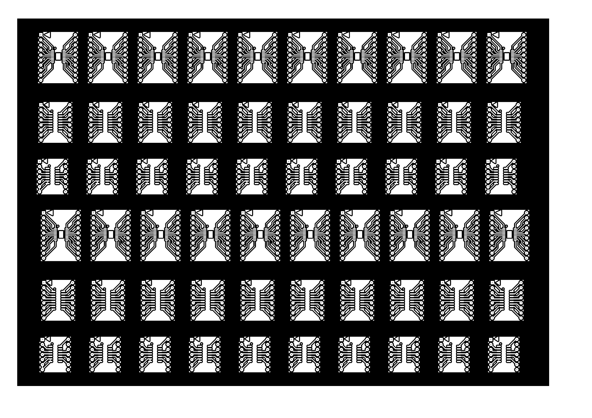

# HomeBus Expanders & Prototyping Adapters

The **HomeBus Expanders** module provides a set of standardized breakout adapters and prototyping daughterboards engineered for rapid bench testing, firmware development, in-circuit emulation, and breadboard interfacing of high-density surface-mount devices (SMD) used throughout the HomeBus ecosystem.

---

## Visual Previews

### Top Copper PCB Layout
The expander board brings high-density SMD IC footprints out to standard 2.54 mm (0.1") dual-row and single-row pin headers:

| Expander Breakout PCB (Top Copper) |
| :---: |
|  |

---

## Adapter Modules & IC Support

| Module Target | IC Footprint | HomeBus Component | Breakout Pitch | Application & Purpose |
| :--- | :--- | :--- | :--- | :--- |
| **Transceiver Breakout** | SOIC-14 (1.27 mm pitch) | Maxim `MAX491CSD` / `MAX491ESD` | 2.54 mm (0.1") Standard DIP Header | Rapid testing of RS-422 differential transmission lines, termination experiments (120Ω resistors), and oscilloscope waveform verification. |
| **Shift Register Breakout**| SOIC-16 (1.27 mm pitch) | NXP / TI `74HC165D` | 2.54 mm (0.1") Standard DIP Header | Prototyping input daisy-chaining, evaluating switch debounce RC filters, and verifying SPI/serial timing (`PL_`, `CP`, `Q7`). |
| **MCU Breakout** | TSSOP-20 (0.65 mm pitch) | WCH `CH32X033F8P6` | 2.54 mm (0.1") Standard DIP Header | Breadboard development, SWD debugging via WCH-LinkE, and hardware expansion before assembling production in-wall PCBs. |

---

## Hardware Specification & PCB Features

- **Standard Breadboard Compatibility**: Spacing between header rows aligns with standard 300-mil and 600-mil breadboards and female socket strips.
- **Test Points & Silkscreen**: Clearly marked pin numbers and signal designations for probe grounding and logic analyzer clip attachment.
- **Fabrication Plots**:
  - Top Copper Layer: [`Expanders-F_Cu.pdf`](Expanders-F_Cu.pdf)
  - Solder Paste Mask: [`Expanders-F_Paste.pdf`](Expanders-F_Paste.pdf)
  - Board Outline / Dimensioning: [`Expanders-Edge_Cuts.pdf`](Expanders-Edge_Cuts.pdf)

---

## Navigation

- [← Hardware Subsystem Overview](../README.md)
- [↑ HomeBus Root Documentation](../../README.md)
- [Base Node Documentation →](../base_node/README.md)
- [Gateway Node Documentation →](../Gateway_node/README.md)
- [Fan Controller Node Documentation →](../Fan_Controller_node/README.md)
- [Firmware & Protocol Specification →](../../Firmware/README.md)
