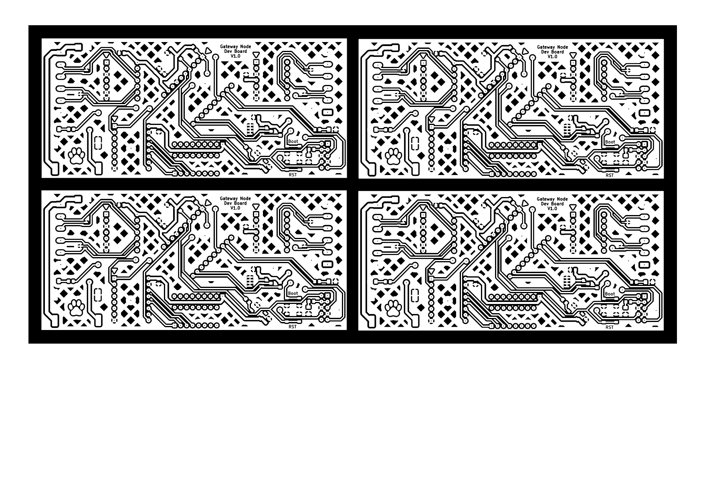
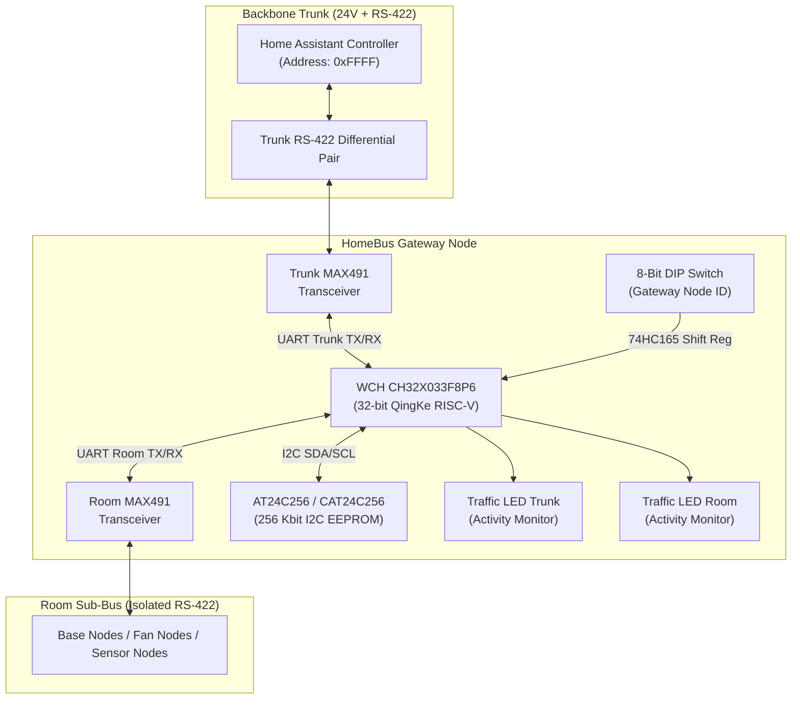

# HomeBus Gateway Node

The **HomeBus Gateway Node** serves as the vital routing bridge, segmentation barrier, and protocol proxy between the central HomeBus **Trunk Backbone Bus** and individual **Room Sub-Buses**.

By dividing the physical automation topology into isolated room-level segments, the Gateway prevents local switch bounces, encoder streams, and internal room traffic from congesting the primary backbone while safeguarding against bus-wide failures.

---

## Visual Previews

### Development Board Copper Layout
The development breakout board provides full access to debugging interfaces, bus headers, and test points:

| Gateway Node Dev Board (Top Copper) |
| :---: |
|  |

---

## System Architecture & Routing Principle

### Gateway Functional Roles
1. **Packet Filtering & Forwarding**:
   - Packets addressed to devices located within the room are routed locally and never leak to the backbone.
   - External commands from Home Assistant (`0xFFFF`) targeting room devices (`0xRRTTDDDD`) are recognized by the Gateway's Room ID prefix (`RR`) and forwarded inward.
   - Sensor telemetry packets from room nodes are forwarded outbound to Home Assistant.
2. **Device Address Resolution & Caching**:
   - The Gateway maintains a local device table in onboard 256-Kbit EEPROM (`AT24C256`).
   - If a logical device (e.g. `0x02030005`) maps to a third-party Tuya smart device or secondary wireless gateway, the Gateway handles the protocol bridge transparently.
3. **OTA Firmware Proxy**:
   - Buffers and relays firmware update blocks destined for individual room nodes, ensuring reliable transmission over point-to-point RS-422 links.

---

## Key Hardware Components

| Component | Part / Package | Subsystem | Description & Function |
| :--- | :--- | :--- | :--- |
| **MCU** | WCH `CH32X033F8P6` (TSSOP-20) | Core Processing | 48 MHz 32-bit RISC-V QingKe V4C core. Manages dual UARTs, packet routing, CRC verification, and routing table lookup. |
| **Trunk Transceiver** | Maxim `MAX491E` (SOP-14) | Backbone Interface | Full-duplex RS-422 transceiver interfacing the high-speed central backbone network. |
| **Room Transceiver** | Maxim `MAX491E` (SOP-14) | Room Sub-Bus | Dedicated full-duplex RS-422 transceiver driving the isolated room sub-bus. |
| **Non-Volatile Memory**| Microchip `AT24C256C` / `CAT24C256` (SOIC-8) | Routing Storage | 256-Kbit (32 KByte) I2C EEPROM. Stores routing tables, device mapping registers, and offline fallback states. |
| **Surge Protection** | ProTek `SM712` (SOT-23) | Bus Protection | Dual asymmetrical TVS diode arrays (-7V to +12V) on both Trunk and Room differential lines. |
| **Shift Register** | TI/NXP `74HC165D` (SOP-16) | Input Multiplexer | Parallel-to-serial shift register reading the 8-position hardware Node ID DIP switch. |
| **Traffic Indicators**| Discrete SMD LEDs + Current Limiters | Diagnostics | Independent status LEDs indicating real-time packet activity on Trunk and Room buses. |
| **Status LED** | Xinglight `XL-1010RGBC` (`WS2812B`) | System Status | Addressable RGB indicator showing boot state, bus lock, error conditions, and sync status. |

---

## Pin Allocation Table

The Gateway Node uses the 20-pin `CH32X033F8P6` to manage dual transceivers, EEPROM, and traffic indication:

| Pin # | MCU Pin | Production Function | Development Function | Net / Description |
| :---: | :---: | :---: | :---: | :--- |
| **1** | PA0 / PC3 | `DNC` | `Boot Switch` | Do Not Connect in Production; Bootloader Entry Switch in Development |
| **2** | PA1 / PC4 | `Room MAX491 DI` | `Room MAX491 DI` | RS-422 Driver Input (MCU UART TX to Room Sub-Bus) |
| **3** | PA2 / PC2 | `Room MAX491 RO` | `Room MAX491 RO` | RS-422 Receiver Output (Room Sub-Bus RX to MCU) |
| **4** | NRST | `RST` | `RST` | Hardware Reset line (active low, pulled high) |
| **5** | PB0 / PC0 | `HC165 Q7` | `HC165 Q7` | 74HC165 Shift Register Serial Data Out (Node ID data) |
| **6** | PB1 | `Neopixel` | `Neopixel` | Single-wire NRZ serial data stream to WS2812B RGB LED |
| **7** | VSS | `GND` | `GND` | System Ground (0V reference) |
| **8** | PB2 / PC6 | `DNC` | `SWDIO` | Do Not Connect in Production; WCH SWD Debug Data in Development |
| **9** | VDD | `VDD` | `VDD` | Logic Supply Rail (+5V / +3.3V) |
| **10** | PB3 / PC8 | `DNC` | `SWD RX` | Do Not Connect in Production; Debug UART RX in Development |
| **11** | PB6 | `I2C SDA` | `I2C SDA` | I2C Serial Data line to CAT24C256 EEPROM |
| **12** | PB7 | `I2C SCL` | `I2C SCL` | I2C Serial Clock line to CAT24C256 EEPROM |
| **13** | PB4 / PC5 | `Traffic Led Trunk` | `Traffic Led Trunk` | Activity LED driver for Trunk Backbone packet transmission |
| **14** | PB5 | `HC165 PL_` | `HC165 PL_` | 74HC165 Shift Register Parallel Load (active low) |
| **15** | PB8 | `HC165 CP` | `HC165 CP` | 74HC165 Shift Register Clock Pulse |
| **16** | PB10 | `MAX491 DI` | `MAX491 DI` | Trunk RS-422 Driver Input (MCU UART TX to Backbone Bus) |
| **17** | PB11 | `MAX491 RO` | `MAX491 RO` | Trunk RS-422 Receiver Output (Backbone Bus RX to MCU) |
| **18** | PB9 / PC7 | `DNC` | `SWCLK` | Do Not Connect in Production; WCH SWD Clock in Development |
| **19** | PA3 / PC1 | `Traffic Led Room` | `Traffic Led Room` | Activity LED driver for Room Sub-Bus packet transmission |
| **20** | PA4 / PC9 | `DNC` | `SWD TX` | Do Not Connect in Production; Debug UART TX in Development |

---

## Development Board Breakout

The repository includes a dedicated breakout board under [`Gateway_node_dev-board/`](Gateway_node_dev-board/):
- **Features**:
  - Full breakout headers for all 20 MCU pins, allowing logic analyzer probing and rapid breadboard interfacing.
  - Onboard tactile buttons for `Boot` and `Reset`.
  - Dual MAX491 screw terminals and test pin sockets.
  - Dedicated WCH-LinkE programming header (SWDIO, SWCLK, 3.3V, GND, TX, RX).
- **Fabrication Plots**:
  - Top Copper: [`Gateway_node_dev-board-F_Cu.pdf`](Gateway_node_dev-board/Gateway_node_dev-board-F_Cu.pdf)
  - Bottom Copper: [`Gateway_node_dev-board-B_Cu.pdf`](Gateway_node_dev-board/Gateway_node_dev-board-B_Cu.pdf)
  - Outline: [`Gateway_node_dev-board-Edge_Cuts.pdf`](Gateway_node_dev-board/Gateway_node_dev-board-Edge_Cuts.pdf)

---

## Navigation

- [← Hardware Subsystem Overview](../README.md)
- [↑ HomeBus Root Documentation](../../README.md)
- [Base Node Documentation →](../base_node/README.md)
- [Fan Controller Node Documentation →](../Fan_Controller_node/README.md)
- [Expander Daughterboards Documentation →](../Expanders/README.md)
- [Firmware & Protocol Specification →](../../Firmware/README.md)
