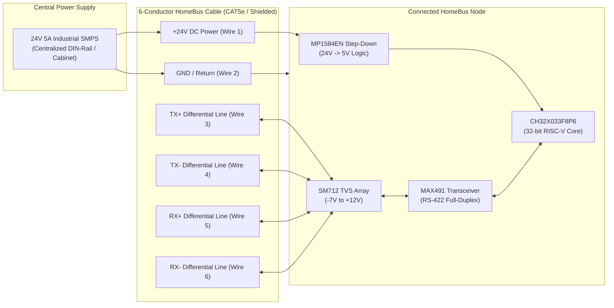

# HomeBus Hardware Subsystem

The **HomeBus Hardware Subsystem** encompasses the schematics, PCB layouts, electrical interfaces, and component specifications that power the HomeBus automation platform. Built on the 32-bit RISC-V `CH32X033F8P6` microcontroller, HomeBus employs a robust wired topology combining a centralized 24V DC power rail with full-duplex RS-422 differential serial communications.

---

## Physical Bus Architecture & Power Distribution

HomeBus uses standard structured cabling (CAT5e / multi-conductor shielded cable) terminated into pluggable terminal blocks (`XY2500` 6-pin connectors):

### Key Electrical Principles
1. **Centralized 24V DC Distribution**: Eliminates bulky and fire-prone AC-to-DC converters inside small wall boxes. Centralizing mains power conversion inside a well-ventilated enclosure ensures high efficiency and simplified battery backup (UPS) integration.
2. **Local Buck Regulation**: Each node integrates an `MP1584EN` high-frequency switching buck module stepping down 24V DC to 5V DC at up to 3A, easily powering the MCU, RGB status LEDs, sensors, and external relay coils without thermal throttling.
3. **Full-Duplex Differential Signaling (RS-422)**: Utilizing dedicated differential pairs for transmit (`TX±`) and receive (`RX±`) driven by Maxim `MAX491` transceivers allows non-blocking, bidirectional communication.
4. **Transient & Surge Protection**: Every differential line interface is clamped by `SM712` asymmetrical TVS diodes designed specifically for RS-422 transceivers, safeguarding against electrostatic discharge (ESD up to ±15 kV) and induced power line transients.

---

## Node Modules & Component Directory

The HomeBus hardware platform is partitioned into specialized node modules:

| Module | Location | Primary Role & Description | Documentation Link |
| :--- | :--- | :--- | :--- |
| **Base Node** | [`base_node/`](base_node/) | In-wall multi-channel actuator and wall-switch sensor interface fitting standard electrical backboxes. | [Base Node README](base_node/README.md) |
| **Gateway Node** | [`Gateway_node/`](Gateway_node/) | Dual-transceiver bridge providing room-level bus segmentation, EEPROM routing tables, and traffic diagnostics. | [Gateway Node README](Gateway_node/README.md) |
| **Fan Controller Node** | [`Fan_Controller_node/`](Fan_Controller_node/) | Solid-state AC speed controller featuring zero-crossing sync (`H11AA1`), isolated gate drive (`HCPL-3120`), and stall prevention. | [Fan Controller README](Fan_Controller_node/README.md) |
| **Expanders** | [`Expanders/`](Expanders/) | Prototyping breakout adapters converting SMD footprints (SOIC-14, SOIC-16, TSSOP-20) to 2.54mm breadboard headers. | [Expanders README](Expanders/README.md) |

---

## Bill of Materials (BOM) Summary

Extracted directly from project engineering records ([`BOM Home automation.xlsx`](BOM%20Home%20automation.xlsx)):

| Category | Component Part | Package | Description | Key Specifications |
| :--- | :--- | :--- | :--- | :--- |
| **Processing** | WCH `CH32X033F8P6` | TSSOP-20 | RISC-V Microcontroller | 48 MHz QingKe V4C, 62 KB Flash, 20 KB SRAM |
| **Networking** | Maxim `MAX491CSD` / `MAX491ESD` | SOP-14 | RS-422 Transceiver | Full-duplex differential transceiver |
| **Input Expansion** | NXP / TI `74HC165D` | SOP-16 | Shift Register | 8-bit Parallel-In Serial-Out (PISO) |
| **Power Buck** | Monolithic Power `MP1584EN` | Module | Step-Down Buck Converter | 24V to 5V DC, 3A max output |
| **Bus Protection**| ProTek `SM712` / `PSM712` | SOT-23 | TVS Diode Array | Asymmetrical (-7V / +12V) RS-422 protection |
| **Status LED** | Xinglight `XL-1010RGBC` (`WS2812B`) | SMD-1010 | Addressable RGB LED | Single-wire data protocol |
| **Zero Crossing** | Vishay `H11AA1` | DIP-6 | AC Optocoupler | Bidirectional input, transistor output |
| **Gate Driver** | Broadcom `HCPL-3120` / `VO3120` | DIP-8 / SOP-8| Optocoupled Gate Driver | 2.5A peak drive, CMR > 15 kV/µs |
| **Isolated DC-DC**| Hi-Link `B2415S-1WR3` | SIP-4 | Isolated Power Module | 24VDC In / 15VDC Out, 1W isolated |
| **AC Switching** | KEC `KIA7N65H` | TO-220F | N-Channel Power MOSFET | 650V, 7A, $R_{DS(on)} = 1.4\ \Omega$ |
| **Current Sense** | `ZHT103` / `HWCT-5A` | Through-Hole | Current Transformer | 5A primary / 5mA secondary |
| **Amplifier** | Microchip `MCP6001` | SOT-23-5 | Operational Amplifier | Rail-to-rail I/O, 1 MHz GBW |
| **Routing Memory**| Microchip `AT24C256C` / `CAT24C256` | SOIC-8 | I2C Serial EEPROM | 256 Kbit (32 KByte), 1 MHz I2C |
| **Mains Varistor**| `10D471K` | Disc 10mm | Metal Oxide Varistor | 470V clamping, 2.5 kA surge |
| **Mains Fuse** | `2010T1A250V` | Radial / 2010 | Slow-Blow Micro Fuse | 1A, 250V AC time-lag |
| **Bus Connector** | `XY2500` Pair (6-Pin) | 5.08mm Pitch | Pluggable Screw Terminal | Rated 300V / 10A, polarized locking |

---

## Custom KiCad EDA Libraries

All schematic symbols, PCB footprints, and 3D CAD assets are maintained in [`lib/`](../lib/):
- **Symbol Library**: [`lib/HomeBus.kicad_sym`](../lib/HomeBus.kicad_sym) — Customized symbols for CH32X033, MP1584 module, optocouplers, and connectors.
- **Footprint Library**: [`lib/HomeBus.kicad_mod/`](../lib/HomeBus.kicad_mod/) — Custom footprints for compact SMD assembly:
  - `XL-1010RGBC-WS2812B.kicad_mod` (SMD-1010 addressable LED)
  - `MP1584 Module.kicad_mod` (DC-DC step-down footprint)
  - `TSSOP-20-2.54_expander.kicad_mod`, `SOIC-16-2.54_expander.kicad_mod`, `SOIC-14-2.54_expander.kicad_mod`
  - `SW_SPST_PTS647_Sx38.kicad_mod` (Tactile push switches)
  - `ZHT103_CT103_2pin.kicad_mod` (Current transformer)
- **3D STEP Models**: [`lib/3D_models/`](../lib/3D_models/) — Includes mechanical CAD models (e.g. `XL-1010RGBC-WS2812B--3DModel-STEP-510211.STEP`).

---

## Navigation

- [↑ HomeBus Root Documentation](../README.md)
- [Base Node Documentation →](base_node/README.md)
- [Gateway Node Documentation →](Gateway_node/README.md)
- [Fan Controller Node Documentation →](Fan_Controller_node/README.md)
- [Expander Daughterboards Documentation →](Expanders/README.md)
- [Firmware & Protocol Specification →](../Firmware/README.md)
