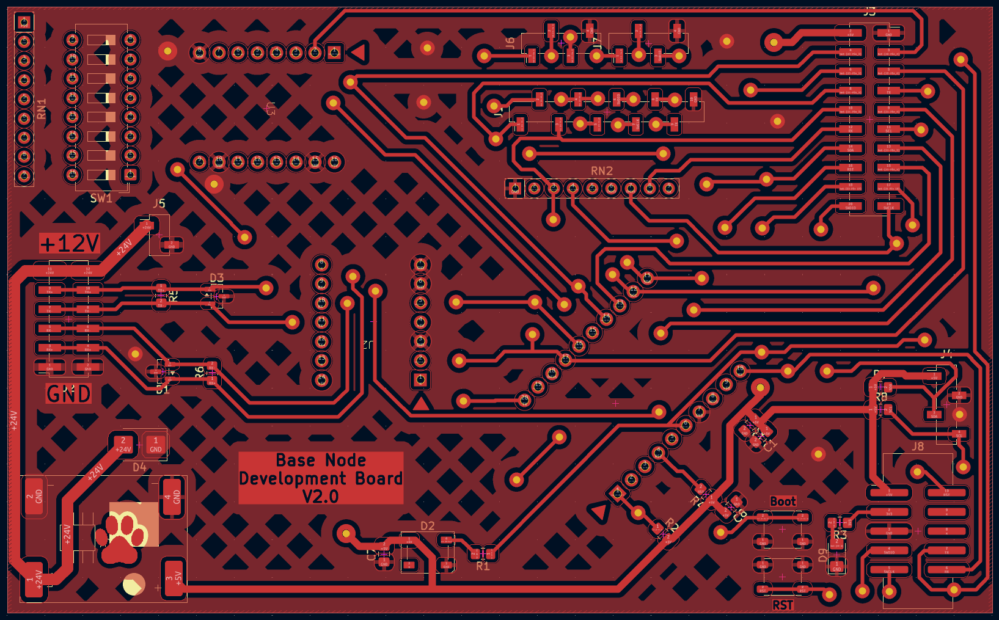
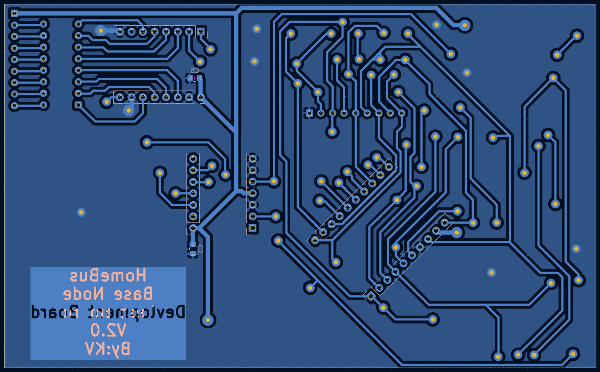
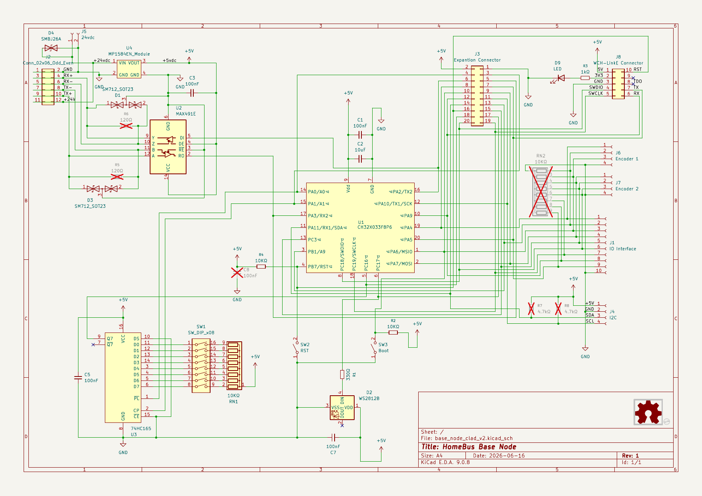
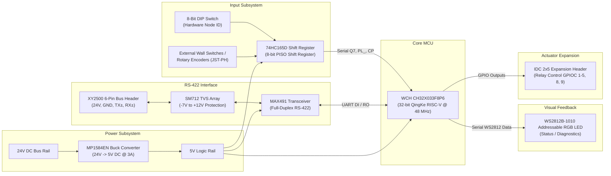

# HomeBus Base Node

The **HomeBus Base Node** is the primary in-wall actuator and sensor module in the HomeBus distributed automation network. Designed to fit into standard residential switch flush boxes behind wall plates, it interfaces physical toggle switches and rotary encoders with the HomeBus RS-422 serial bus while driving external relay modules to switch lights, appliances, and inductive loads.

---

## Visual Previews

### 3D Production Renders
| Front View (Component Side) | Back View (Connector Side) |
| :---: | :---: |
|  |  |

### Manufacturing Schematic

---

## Hardware Architecture

---

## Key Hardware Components

| Subsystem | Component | Package | Function / Rationale |
| :--- | :--- | :--- | :--- |
| **Microcontroller** | WCH `CH32X033F8P6` | TSSOP-20 | QingKe 32-bit RISC-V V4C core @ 48 MHz, 62 KB Flash, 20 KB SRAM. Handles RS-422 protocol stack, switch debouncing, and relay actuation. |
| **Transceiver** | Maxim `MAX491CSD` / `MAX491ESD` | SOP-14 | High-speed, full-duplex RS-422/RS-485 differential transceiver. Allows simultaneous transmit and receive with no collision backoff. |
| **Input Multiplexer** | NXP / TI `74HC165D` | SOP-16 | 8-bit Parallel-In Serial-Out (PISO) shift register. Samples the 8-bit DIP switch and wall inputs using only 3 MCU pins (`PL_`, `CP`, `Q7`). |
| **Power Converter** | Monolithic Power `MP1584EN` | Modular Module | 3A high-frequency step-down switching buck regulator module converting centralized 24V bus power to regulated 5V system logic. |
| **Surge Protection** | ProTek `SM712` / `PSM712` | SOT-23 | Asymmetrical bidirectional TVS diode array (-7V to +12V) specifically engineered for RS-422 lines against ESD, EFT, and power transients. |
| **Status Indicator** | Xinglight `XL-1010RGBC` (`WS2812B-1010`) | SMD-1010 (1.0x1.0mm) | Ultra-compact single-wire addressable RGB LED for status indication, network link health, and commissioning feedback. |
| **Hardware ID** | 8-Position SPST DIP Switch | 2.54mm Pitch Slide | Configures physical Node ID (1–255) for commissioning, telemetry, and OTA management. |

---

## Pin Allocation Table

The Base Node assigns the 20 pins of the `CH32X033F8P6` as follows, differentiating between **Development** mode (SWD debug available) and **Production** mode (SWD pins repurposed for actuator GPIOs):

| Pin # | MCU Pin | Production Function | Development Function | Net / Description |
| :---: | :---: | :---: | :---: | :--- |
| **1** | PA0 / PC3 | `GPIOC 3` | `Boot Switch` | Actuator Output 3 in Production; Bootloader entry trigger in Development |
| **2** | PA1 / PC4 | `GPIOC 4` | `GPIOC 4` | Actuator Output 4 / Relay drive line |
| **3** | PA2 / PC2 | `GPIOC 2` | `GPIOC 2` | Actuator Output 2 / Relay drive line |
| **4** | NRST | `RST` | `RST` | Hardware Reset line (active low, with pull-up) |
| **5** | PB0 / PC0 | `HC165 Q7` | `HC165 Q7` | Shift Register Serial Data Out (MISO stream to MCU) |
| **6** | PB1 | `Neopixel` | `Neopixel` | High-speed single-wire NRZ serial data stream to WS2812B LED |
| **7** | VSS | `GND` | `GND` | System Ground (0V reference) |
| **8** | PB2 / PC6 | `GPIOC 6` | `SWDIO` | Actuator Output 6 in Production; WCH SWD Debug Data in Development |
| **9** | VDD | `VDD` | `VDD` | Logic Supply Rail (+5V DC from MP1584EN) |
| **10** | PB3 / PC8 | `GPIOC 8` | `SWD RX` | Actuator Output 8 in Production; Debug UART RX in Development |
| **11** | PB6 | `I2C SDA` | `I2C SDA` | I2C Serial Data line for auxiliary sensor daughterboards |
| **12** | PB7 | `I2C SCL` | `I2C SCL` | I2C Serial Clock line for auxiliary sensor daughterboards |
| **13** | PB4 / PC5 | `GPIOC 5` | `GPIOC 5` | Actuator Output 5 / Relay drive line |
| **14** | PB5 | `HC165 PL_` | `HC165 PL_` | 74HC165 Asynchronous Parallel Load (active low) |
| **15** | PB8 | `HC165 CP` | `HC165 CP` | 74HC165 Shift Register Clock Pulse |
| **16** | PB10 | `MAX491 DI` | `MAX491 DI` | RS-422 Driver Input (MCU UART TX to RS-422 differential bus) |
| **17** | PB11 | `MAX491 RO` | `MAX491 RO` | RS-422 Receiver Output (RS-422 differential bus to MCU UART RX) |
| **18** | PB9 / PC7 | `GPIOC 7` | `SWCLK` | Actuator Output 7 in Production; WCH SWD Clock in Development |
| **19** | PA3 / PC1 | `GPIOC 1` | `GPIOC 1` | Actuator Output 1 / Relay drive line |
| **20** | PA4 / PC9 | `GPIOC 9` | `SWD TX` | Actuator Output 9 in Production; Debug UART TX in Development |

---

## Revision History

1. **`base_node` (v1.0)**: Initial prototype layout. Used orthogonal 45° routing and tested basic connectivity between the CH32X033 and MAX491.
2. **`base_node-rounded` (v1.1)**: Experimental PCB layout with circular/curved track fillets using KiCad round-tracks plugin for aesthetic evaluation and high-speed trace continuity.
3. **`base_node_clad` (v1.2)**: Added continuous solid copper pour cladding across top and bottom layers, significantly reducing ground impedance and improving EMI containment in high-noise AC environments.
4. **`base_node_clad_v2` (v2.0 - Production)**:
   - Optimized high-voltage isolation creepage and clearance distances between mains-connected lines and low-voltage logic.
   - Refined component clearances for compact hand-soldering and reflow stenciling.
   - Added reinforced thermal pads and teardrop transitions on signal vias.
   - Verified Gerber generation ready for industrial fabrication under [`Basenode_gerber/`](Basenode_gerber/).

---

## Manufacturing & Assembly

- **Gerber Files**: Ready-to-manufacture archives are stored in [`Basenode_gerber/base_node.zip`](Basenode_gerber/base_node.zip).
- **PCB Fabrication Parameters**:
  - Layers: 2-layer FR-4
  - Board Thickness: 1.6 mm
  - Copper Weight: 1 oz (35 µm)
  - Surface Finish: HASL Lead-Free / ENIG recommended
  - Minimum Trace / Space: 0.2 mm / 0.2 mm
  - Solder Mask: Blue / Matte Black
  - Silkscreen: White
- **Fabrication Plots**:
  - Top Copper: [`base_node_clad_v2-F_Cu.pdf`](base_node_clad_v2-F_Cu.pdf)
  - Bottom Copper: [`base_node_clad_v2-B_Cu.pdf`](base_node_clad_v2-B_Cu.pdf)
  - Edge Cuts / Outline: [`base_node_clad_v2-Edge_Cuts.pdf`](base_node_clad_v2-Edge_Cuts.pdf)

---

## Navigation

- [← Hardware Subsystem Overview](../README.md)
- [↑ HomeBus Root Documentation](../../README.md)
- [Gateway Node Documentation →](../Gateway_node/README.md)
- [Fan Controller Node Documentation →](../Fan_Controller_node/README.md)
- [Expander Daughterboards Documentation →](../Expanders/README.md)
- [Firmware & Protocol Specification →](../../Firmware/README.md)
