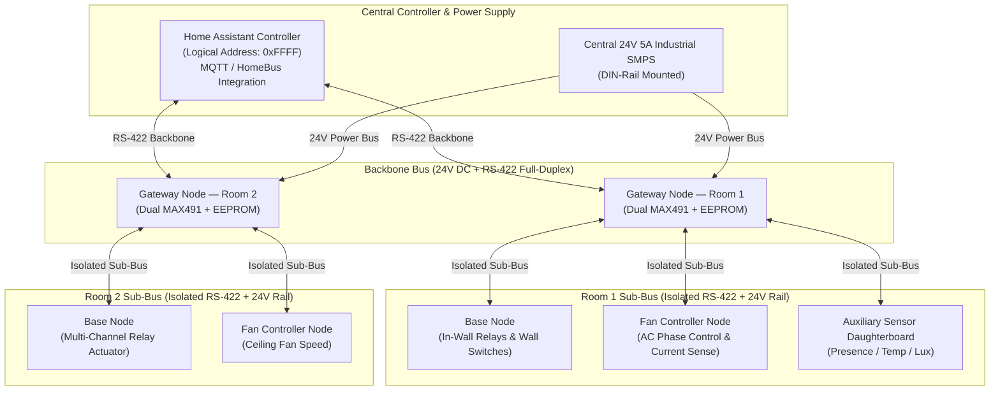

<p align="center">
  
</p>

<h1 align="center">HomeBus</h1>

<p align="center">
  <strong>A deterministic, hard-wired distributed home automation platform built on 32-bit RISC-V microcontrollers, full-duplex RS-422 differential networking, centralized 24V DC power distribution, and native Home Assistant integration.</strong>
</p>

<p align="center">
  <a href="#system-architecture">Architecture</a> •
  <a href="#hierarchical-documentation">Documentation Map</a> •
  <a href="#hardware-overview">Hardware</a> •
  <a href="#protocol--firmware">Protocol & Firmware</a> •
  <a href="#repository-structure">Repository Structure</a> •
  <a href="#getting-started--toolchain">Getting Started</a>
</p>

---

## Overview & Motivation

Modern smart homes face severe reliability degradation when relying on congested 2.4 GHz wireless networks (Wi-Fi, Zigbee, Bluetooth). RF interference, wireless mesh packet dropouts, battery maintenance for wall sensors, and high-latency cloud dependencies undermine home automation dependability.

**HomeBus** solves this by delivering an industrial-grade, hard-wired residential infrastructure:
- **Full-Duplex RS-422 Differential Signaling**: Non-blocking serial communications operating at high baud rates without bus collision arbitration.
- **Centralized 24V DC Power Distribution**: Power and high-speed data are distributed over a single multi-conductor cable (CAT5e), eliminating failure-prone miniature AC-DC supplies inside cramped wall flush boxes.
- **Hardware/Logical Decoupling**: Wall switches trigger 32-bit logical device endpoints (`0xRRTTDDDD`). Physical hardware nodes (identified via 8-bit DIP switches) can be re-routed, replaced, or bridged to third-party devices (such as Tuya or Zigbee) without modifying wall switch wiring or node code.
- **Room-Level Gateway Segmentation**: Dual-transceiver gateway nodes divide the physical network into isolated room segments, insulating the central backbone from local switch traffic and safeguarding against bus-wide faults.
- **Fail-Safe Dual-Slot OTA Updates**: Permanent bootloader with ping-pong application flash partitions and automatic health verification rollbacks.

---

## System Architecture



---

## Hierarchical Documentation

The HomeBus documentation is hierarchically organized to provide deep technical detail at every layer while maintaining clean separation of concerns:

```text
README.md (Master Root)
├── Hardware/README.md (Hardware Subsystem Overview)
│   ├── base_node/README.md (In-Wall Actuator & Switch Interface)
│   ├── Gateway_node/README.md (Dual-Transceiver Room Segmentation Router)
│   ├── Fan_Controller_node/README.md (AC Phase-Angle Fan Speed Controller)
│   └── Expanders/README.md (Prototyping Adapters & Footprint Breakouts)
└── Firmware/README.md (Firmware & Protocol Specification v0.1)
```

### Direct Documentation Links

| Layer | Subsystem / Component | Key Documentation Topics | Link |
| :--- | :--- | :--- | :--- |
| **Subsystem** | **Hardware Platform** | 24V Bus power distribution, RS-422 differential signaling, SM712 surge protection, complete Bill of Materials (BOM), KiCad custom symbol & footprint libraries. | [Hardware Subsystem Overview](Hardware/README.md) |
| **Component** | **Base Node** | In-wall multi-channel relay actuator, 74HC165 switch shift register, CH32X033 TSSOP-20 pinouts (Dev vs Prod), 3D production renders, manufacturing schematics. | [Base Node README](Hardware/base_node/README.md) |
| **Component** | **Gateway Node** | Dual MAX491 transceivers, CAT24C256 I2C EEPROM routing tables, traffic monitoring LEDs, dedicated development breakout board. | [Gateway Node README](Hardware/Gateway_node/README.md) |
| **Component** | **Fan Controller Node** | H11AA1 zero-crossing detection, HCPL-3120 isolated gate drive, B2415S isolated DC-DC, KIA7N65H solid-state AC switching, active stall threshold protection. | [Fan Controller README](Hardware/Fan_Controller_node/README.md) |
| **Component** | **Expanders** | SMD prototyping daughterboards converting SOIC-14 (MAX491), SOIC-16 (74HC165), and TSSOP-20 (CH32X033) to standard 2.54 mm breadboard headers. | [Expanders README](Hardware/Expanders/README.md) |
| **Subsystem** | **Firmware & Protocol** | 32-bit Logical Device Addresses (`0xRRTTDDDD`), 8-bit Physical Node IDs, Control and Telemetry packet structures, Sensor Types, dual-slot ping-pong OTA bootloader. | [Firmware & Protocol README](Firmware/README.md) |

---

## Hardware Overview

### Base Node Production Renders

| Front View (Component Layout) | Back View (Connector & Power Rail) |
| :---: | :---: |
|  |  |

### Core Hardware Specifications
- **Processing Core**: WCH `CH32X033F8P6` (32-bit QingKe RISC-V V4C core @ 48 MHz, 62 KB Flash, 20 KB SRAM).
- **Physical Layer Transceiver**: Maxim `MAX491CSD` / `MAX491ESD` (SOP-14 full-duplex differential transceiver).
- **Bus Power Regulation**: Monolithic Power Systems `MP1584EN` (high-frequency buck converter, 24V In to 5V DC Out @ 3A).
- **Transient Protection**: ProTek `SM712` asymmetrical bidirectional TVS diode array (-7V to +12V) on all RS-422 differential pairs.
- **Input Multiplexing**: NXP / TI `74HC165D` 8-bit PISO shift register for parallel sampling of physical wall switches and the 8-bit DIP switch.
- **Visual Feedback**: Xinglight `XL-1010RGBC` (`WS2812B-1010`) addressable RGB LED for link status and diagnostics.
- **Detailed Component Records**: Complete component pricing, supplier links, and quantities are tracked in [`Hardware/BOM Home automation.xlsx`](Hardware/BOM%20Home%20automation.xlsx).

---

## Protocol & Firmware Highlights

For the full technical protocol specification, see the [Firmware & Protocol Documentation](Firmware/README.md).

### Logical vs. Physical Addressing
- **Physical Node ID (8-bit)**: Set on the hardware DIP switch (1–255). Used strictly for commissioning, OTA updates, diagnostics, and telemetry.
- **Logical Device Address (32-bit)**: Structured as `0xRRTTDDDD`:
  - `RR`: Room ID (e.g. `0x01` Living Room)
  - `TT`: Device Type (e.g. `0x01` Relay, `0x04` Fan)
  - `DDDD`: Device Unique Index
  - `0xFFFF`: Home Assistant Central Controller
- *Input nodes never transmit physical node IDs—wall switches target logical devices, allowing seamless device migration and third-party bridging.*

### Dual-Slot Failsafe OTA Bootloader
Each node partitions its 62 KB flash into a permanent bootloader (8 KB), Application Slot A (24 KB), Application Slot B (24 KB), and Non-Volatile Config (8 KB). Firmware updates are verified with 16-bit CRC before switching execution slots, with automated fallback if health confirmation is not returned.

---

## Repository Structure

```text
HomeBus/
├── Datasheets/                                # Technical datasheets for all ICs and sensors
│   ├── 7N65H.PDF                              # KEC 650V 7A Power MOSFET
│   ├── CH32X035.pdf                           # WCH RISC-V Microcontroller Series
│   ├── HCPL3120.pdf                           # Broadcom High-CMR Gate Driver
│   ├── HWCT-5A(5mA).pdf                       # AC Current Transformer
│   ├── MCP6001.pdf                            # Microchip Rail-to-Rail Op-Amp
│   ├── RGB_LED_C5349936.pdf                   # XL-1010RGBC Addressable RGB LED
│   └── vo3120.pdf                             # Vishay High-Speed Optocoupler
├── Firmware/                                  # Firmware subsystem and protocol specifications
│   ├── HomeBus Protocol Specification v0.1.docx # Upstream design document
│   └── README.md                              # Complete protocol specification & packet format guide
├── Hardware/                                  # Hardware design, schematics, and layouts
│   ├── BOM Home automation.xlsx               # Comprehensive Bill of Materials with pricing & links
│   ├── Pin Allocations.xlsx                   # MCU GPIO allocation reference (Dev vs Prod)
│   ├── README.md                              # Hardware subsystem overview & bus topology
│   ├── base_node/                             # In-wall actuator & switch node PCB (Revisions 1 to 4)
│   │   ├── Basenode_gerber/                   # Industrial fabrication Gerbers and drill maps
│   │   ├── Front_production.png               # 3D PCB front render
│   │   ├── Back_production.png                # 3D PCB back render
│   │   ├── Schematic_manufacturing.pdf        # Production schematic plot
│   │   └── README.md                          # Base Node component documentation
│   ├── Gateway_node/                          # Segmentation bridge & routing node
│   │   ├── Gateway_node_dev-board/            # Prototyping development board layout & plots
│   │   └── README.md                          # Gateway Node component documentation
│   ├── Fan_Controller_node/                   # AC phase-angle fan speed controller PCB
│   │   └── README.md                          # Fan Controller Node component documentation
│   └── Expanders/                             # SMD to 2.54mm breadboard prototyping adapters
│       └── README.md                          # Expanders component documentation
├── lib/                                       # KiCad custom symbol, footprint, and 3D libraries
│   ├── 3D_models/                             # Mechanical STEP models
│   ├── HomeBus.kicad_mod/                     # Footprint library (.kicad_mod)
│   └── HomeBus.kicad_sym                      # Schematic symbol library
├── HomeBus_Logo.png                           # Raster logo asset
├── HomeBus_Logo.svg                           # Vector logo asset
└── README.md                                  # Root documentation hub
```

---

## Getting Started & Toolchain

### Hardware Design (EDA)
- **EDA Suite**: [KiCad 7.x / 8.x](https://www.kicad.org/)
- **Opening Projects**: Double-click `.kicad_pro` inside any node directory (e.g. `Hardware/base_node/base_node_clad_v2.kicad_pro`).
- **Libraries**: All custom components are pre-configured in project-relative paths pointing to `lib/HomeBus.kicad_sym` and `lib/HomeBus.kicad_mod/`.

### Firmware Development & Debugging
- **Core Architecture**: QingKe 32-bit RISC-V V4C (`rv32imac`).
- **Toolchain**: `riscv-none-elf-gcc` / MounRiver Studio / OpenOCD for WCH.
- **Hardware Debugger**: [WCH-LinkE](https://www.wch-ic.com/products/WCH-Link.html) programmer/debugger connected via 1-wire SWD (`SWDIO`, `SWCLK`, `GND`, `3V3`).

---

## License & Authorship

All hardware designs, schematics, PCB artwork, and protocol specifications are authored by **Kaustubh** (`koko69420`). All rights reserved.
