<p align="center">
  
</p>

# HomeBus

HomeBus is a distributed, hard-wired home automation hardware and protocol platform built on RISC-V microcontrollers, full-duplex RS-422 serial networking, 24V centralized power distribution, and native Home Assistant integration.

Designed as a robust, wired alternative to congested wireless IoT networks (Wi-Fi/Zigbee), HomeBus decouples physical hardware nodes from logical device endpoints, enabling seamless device migration, zero-arbitration communication, and isolated room-level segmentation.

---

## Features

- **Full-Duplex RS-422 Serial Backbone**: Point-to-point and segmented bus architecture operating without bus collisions or complex arbitration.
- **24V Central Power Distribution**: Single bus cable distributes both high-speed data and 24V DC power to all connected room nodes.
- **Hardware/Logical Decoupling**:
  - **Physical Node IDs**: Hardware addressing set via 8-position DIP switches, used strictly for commissioning, OTA, diagnostics, and telemetry.
  - **Logical Device Addresses**: 32-bit logical addressing (`0xRRTTDDDD`: Room, Type, Device) allowing input devices to trigger endpoints without knowing the physical implementation.
- **Gateway Room Segmentation**: Dual-transceiver gateway nodes isolate room-level traffic from the primary backbone bus.
- **Modular Hardware Nodes**:
  - **Base Node**: In-wall actuator and sensor module controlling multi-channel relays, digital inputs, and status indication.
  - **Fan Controller Node**: Phase/speed control node with active stall threshold protection, soft acceleration, and RPM feedback.
  - **Gateway Node**: Routing bridge between backbone and room bus, maintaining local mapping tables and Tuya/Home Assistant bridges.
  - **Expanders**: Expansion headers for secondary sensor hats and auxiliary relays.
- **Robust Telemetry & Control**:
  - Event-driven reporting for instant switch responses, motion/presence, and contact sensors.
  - Periodic telemetry for temperature, humidity, current/voltage, and power metering.
  - 16-bit CRC packet verification on all transactions.
- **Failsafe Dual-Slot OTA Deployment**: Permanent hardware bootloader with dual application flash slots (Slot A / Slot B ping-pong) and automated health-check rollback.

---

## System Architecture

```mermaid
flowchart TD
    subgraph Controller ["Central Controller"]
        HA["Home Assistant (Address: 0xFFFF)\nMQTT / HomeBus Integration"]
    end

    subgraph Backbone ["Backbone Bus (24V + RS-422 Full-Duplex)"]
        GW1["Gateway Node\n(Room 1)"]
        GW2["Gateway Node\n(Room 2)"]
    end

    subgraph Room1 ["Room 1 Sub-Bus (RS-422)"]
        BN1["Base Node\n(Relays / Switches)"]
        FN1["Fan Controller Node\n(Speed / RPM)"]
        SN1["Sensor Node\n(Presence / Temp / Current)"]
    end

    HA <-->|Backbone Bus| GW1
    HA <-->|Backbone Bus| GW2
    GW1 <-->|Isolated Room Bus| BN1
    GW1 <-->|Isolated Room Bus| FN1
    GW1 <-->|Isolated Room Bus| SN1
```



---

## Hardware Specification

### Base Node Production Renders

| Base Node — Front (3D Render) | Base Node — Back (3D Render) |
| :---: | :---: |
|  |  |

### Core Electronics & Microcontroller
- **MCU**: WCH CH32X035 / CH32X033 (32-bit RISC-V QingKe V4C core, up to 48MHz, 62KB Flash, 20KB SRAM).
- **Communication Transceiver**: MAX491 / SP491 full-duplex RS-422/RS-485 transceivers.
- **Power Subsystem**:
  - Bus Supply: 24V DC centralized rail.
  - Onboard Buck Regulation: MP1584 high-efficiency step-down converter delivering 5V/3.3V logic supply.
- **Isolation & Drive Stage**:
  - Gate Drivers / Optocouplers: Broadcom HCPL-3120 / Vishay VO3120 high-CMR optocoupled gate drivers.
  - Switching Transistors: 7N65H N-channel high-voltage Power MOSFETs.
- **Sensing & Monitoring**:
  - Current Transformer: HWCT-5A (5mA secondary) for isolated AC current sensing.
  - Analog Conditioning: Microchip MCP6001 rail-to-rail input/output operational amplifier.
  - Visual Indicators: Addressable WS2812B RGB LEDs (Xinglight XL-1010RGBC) for status, link health, and debug illumination.

### Connectors & Physical Interfaces
- **Bus Connections**: Multi-conductor screw terminals and RJ45/IDC connectors carrying differential pairs (TX±, RX±) and 24V/GND.
- **Hardware Addressing**: 8-position SPST DIP switch (PTS647 / SMD) for 1–255 physical Node ID selection.

---

## Protocol Specification (v0.1)

### Logical Addressing Scheme
Logical addresses are 32-bit identifiers structured as `0xRRTTDDDD`:
- **`RR` (8-bit)**: Room ID (e.g., `0x01` Living Room, `0x02` Master Bedroom).
- **`TT` (8-bit)**: Device Type category:
  - `0x01`: Relay / Light
  - `0x02`: Dimmer
  - `0x03`: Spotlight
  - `0x04`: Fan
  - `0x05`: RGB Controller
- **`DDDD` (16-bit)**: Device Unique Index within room/type.
- **Reserved `0xFFFF`**: System Central Controller (Home Assistant).

### Packet Structures

#### 1. Control Packet (Device Action)
Used to actuate a logical device. Does not include source ID—actuators execute based on logical target.
```text
+-----------------------+---------+----------------+---------+-------+
|  Destination Address  | Command | Payload Length | Payload | CRC16 |
|        (32-bit)       | (8-bit) |    (8-bit)     | (N-byte)|(16-bit|
+-----------------------+---------+----------------+---------+-------+
```
Supported Commands:
- `0x01`: `SET_STATE` (ON / OFF)
- `0x02`: `TOGGLE`
- `0x03`: `SET_PERCENT` (0–100%)
- `0x04`: `INCREASE_PERCENT`
- `0x05`: `DECREASE_PERCENT`
- `0x06`: `SET_BRIGHTNESS`
- `0x07`: `SET_COLOR`
- `0x08`: `IDENTIFY`

#### 2. Telemetry Packet (Sensor Data)
Used by input sensors, power meters, and environmental nodes to report state to Home Assistant (`0xFFFF`).
```text
+---------------------+---------+-------------+----------------+---------+-------+
| Destination (0xFFFF)| Node ID | Sensor Type | Payload Length | Payload | CRC16 |
|       (32-bit)      | (8-bit) |   (8-bit)   |    (8-bit)     | (N-byte)|(16-bit|
+---------------------+---------+-------------+----------------+---------+-------+
```
Sensor Types:
- `0x01`: Temperature | `0x02`: Humidity | `0x03`: Presence/Motion | `0x04`: Lux / Ambient Light
- `0x05`: Current | `0x06`: Active Power | `0x07`: Voltage | `0x08`: Total Energy | `0x09`: Fan Tachometer RPM

---

## Project Structure

```text
HomeBus/
├── Datasheets/                     # Component technical datasheets (CH32X035, MAX491, optos, CT)
├── Firmware/
│   └── HomeBus Protocol Specification v0.1.docx # Protocol definition reference
├── Hardware/
│   ├── BOM Home automation.xlsx    # Project bill of materials
│   ├── Pin Allocations.xlsx        # Microcontroller GPIO mapping reference
│   ├── Expanders/                  # Auxiliary expansion hat schematics
│   ├── Fan_Controller_node/        # Triac/MOSFET ceiling fan controller PCB
│   ├── Gateway_node/               # Dual RS-422 bus router & dev board PCB
│   └── base_node/                  # Multi-channel in-wall relay & switch node PCB
├── HomeBus_Logo.png                # Project raster emblem
├── HomeBus_Logo.svg                # Project vector branding
├── lib/                            # KiCad custom symbol & footprint libraries
│   ├── 3D_models/                  # Component step models
│   ├── HomeBus.kicad_mod/          # Footprint library
│   └── HomeBus.kicad_sym          # Schematic symbol library
└── README.md                       # Project documentation
```

---

## Hardware Design & EDA

The hardware design files are developed using **KiCad 7 / 8**:
- Open `.kicad_pro` project files directly in KiCad to view schematics (`.kicad_sch`) and PCB layouts (`.kicad_pcb`).
- Production manufacturing outputs (Gerber files and drill maps) for the base node are pre-generated under `Hardware/base_node/Basenode_gerber/`.
- Printable assembly and layer verification plots are available in PDF format under `Hardware/base_node/`.

---

## Firmware & Commissioning

### Bootloader and Memory Mapping
Each node implements a flash partitioning scheme supporting dual application slots:
- `0x00000000 - 0x00001FFF`: Permanent Serial Bootloader
- `0x00002000 - 0x00007FFF`: Application Slot A
- `0x00008000 - 0x0000DFFF`: Application Slot B
- `0x0000E000 - 0x0000FFFF`: Non-volatile Node Configuration & Calibration parameters

### Commissioning Workflow
1. Set the physical **Node ID** (1–255) on the 8-position DIP switch.
2. Connect the node to the 24V RS-422 bus.
3. Upon first boot, a blank node broadcasts a `Commission Request` packet with its Node ID and capability descriptor to Home Assistant.
4. The central controller binds the node and issues configuration over the bus.

---

## License

No license is explicitly defined in this repository. All rights reserved by the author.
